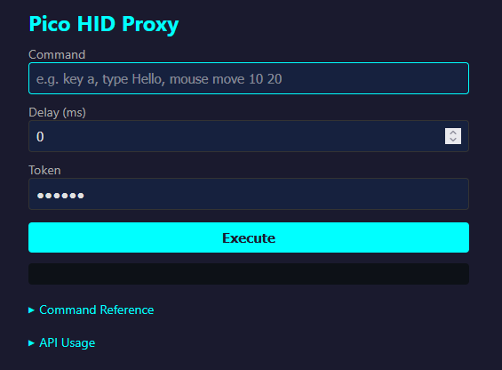
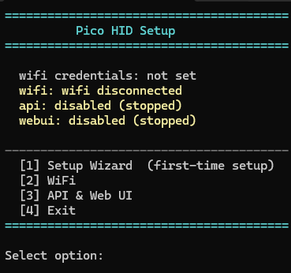

# Pico HID

A Raspberry Pi Pico 2 W acting as a USB HID keyboard and mouse, controlled over serial or WiFi from a host PC or any device on the network.



## Setup

### Flash Firmware

1. Hold BOOTSEL on the Pico and plug it in (or send `reboot bootloader` if already connected)
2. Copy `pico_hid_firmware.uf2` to the USB drive that appears

### Configure

Plug the Pico in normally and run the setup script for your OS. No dependencies required.

| OS | Script |
|---|---|
| Windows | `setup-windows.bat` |
| Linux / macOS | `./setup-linux.sh` |

The setup wizard walks you through WiFi configuration, API token, and enabling the web UI.



> [!TIP]
> On Linux, you may need serial port permissions. The script will prompt you to add yourself to the `dialout` group or run with `sudo`.

### Manual Setup

If you prefer to configure manually, connect via the serial host script and run commands directly:

```
api token mysecrettoken
wifi connect MyNetwork MyPassword
webui enable
```

Credentials, token, and enable states persist across reboots — the Pico will auto-connect on power up.

## WiFi Web Control

The Pico can connect to a WiFi network and serve a web interface for sending commands from any device on the same network, no serial connection needed.

The API and web UI are disabled by default. Use `webui enable` to enable the web interface (this also enables the API). To enable only the API without the web UI, use `api enable` instead.

On success, the Pico prints the URL (e.g. `WEB http://192.168.1.42`). Open it in any browser to access the control page.

### API

The web interface uses a JSON API that can also be called directly:

```
curl -X POST http://PICO_IP/api \
  -H "Content-Type: application/json" \
  -d '{"cmd":"key type Hello","delay":0,"token":"mysecrettoken"}'
```

Response: `{"ok":true,"result":"OK"}`

The `delay` field (in milliseconds) adds a wait before executing the command.

## Project Structure

```
device/          MicroPython code that runs on the Pico (frozen into firmware)
host/            Setup scripts and interactive serial host
firmware/        Built UF2 firmware output
input_monitor/   Windows tool to detect real vs emulated input
```

## Building Firmware

The device code is frozen into a custom MicroPython firmware, producing a single `.uf2` file. The build runs in Docker. No local toolchain needed.

### Prerequisites

- [Docker](https://docs.docker.com/get-docker/)

### Build

```
./build_firmware.sh
```

This builds MicroPython v1.27.0 for `RPI_PICO2_W` with all `device/` code and the `usb-device-hid` library frozen in. Output: `firmware/pico_hid_firmware.uf2`.

To update MicroPython version edit the `Dockerfile` or run with `--build-arg MICROPYTHON_TAG=v1.27.0` arg.

The first build takes a few minutes (cloning MicroPython, compiling toolchain). Subsequent builds after code changes are fast thanks to Docker layer caching.

To force a clean rebuild:

```
./build_firmware.sh --clean
```

## Host Script

An interactive serial console for sending commands directly to the Pico.

### Prerequisites

- Python 3.12+

Optionally create a conda environment:

```
conda create -n pico-hid python=3.12 -y
conda activate pico-hid
```

Install dependencies:

```
pip install -r requirements.txt
```

### Connect

```
python host/host.py          # auto-detect port
python host/host.py COM5     # manual port
```

Type `help` once connected for a list of commands.

## Commands

### Keyboard

| Command | Description |
|---|---|
| `key tap <name>` | Press and release a key |
| `key down <name>` / `key up <name>` | Hold / release a key |
| `key mod <mods> <key>` | Modifier combo (e.g. `key mod ctrl+shift esc`) |
| `key type <text>` | Type a string |
| `key release` | Release all held keys |

### Mouse

| Command | Description |
|---|---|
| `mouse move <dx> <dy>` | Relative mouse move |
| `mouse abs <x> <y>` | Absolute mouse move (0–32767) |
| `mouse click <btn>` | Click left/right/middle |
| `mouse down <btn>` / `mouse up <btn>` | Hold / release button |
| `mouse scroll <n>` | Scroll (positive = up) |
| `mouse release` | Release all held buttons |

### WiFi

| Command | Description |
|---|---|
| `wifi set <ssid> <password>` | Save WiFi credentials without connecting |
| `wifi get` | Show saved credentials |
| `wifi connect [ssid] [password]` | Connect to WiFi (saves credentials if provided, uses saved if not) |
| `wifi disconnect` | Disconnect from WiFi |
| `wifi status` | Show connection status, IP, and signal strength |
| `wifi clear` | Delete saved credentials and disconnect |

### API

| Command | Description |
|---|---|
| `api token <value>` | Set the API token for web access |
| `api enable` | Enable the API |
| `api disable` | Disable the API (also disables web UI) |
| `api status` | Show whether the API is enabled or disabled |

### Web UI

| Command | Description |
|---|---|
| `webui enable` | Enable the web UI (also enables the API) |
| `webui disable` | Disable the web UI |
| `webui status` | Show whether the web UI is enabled or disabled |

### System

| Command | Description |
|---|---|
| `ping` | Test connection (returns PONG) |
| `status` | Show overall system status (wifi, api, webui) |
| `reboot` | Restart the Pico |
| `reboot bootloader` | Reboot Pico into BOOTSEL (UF2 flash) mode |

## Input Monitor

A separate Windows tool that uses low-level hooks (`WH_KEYBOARD_LL` / `WH_MOUSE_LL`) to detect whether keyboard and mouse events are real hardware input or emulated/injected. Checks the `LLKHF_INJECTED` and `LLMHF_INJECTED` flags set by the OS on synthetic input.

Run the monitor (requires native Windows Python, does not work with WSL):

```
python input_monitor/main.py
```

Press Ctrl+C to stop the monitor.

## Licenses

This firmware is built for Raspberry Pi Pico 2 W and includes MicroPython (MIT), Pico SDK (BSD-3-Clause), TinyUSB (MIT), lwIP (BSD), cyw43-driver and BTstack (licensed by Raspberry Pi Ltd for use with Pico W hardware).
